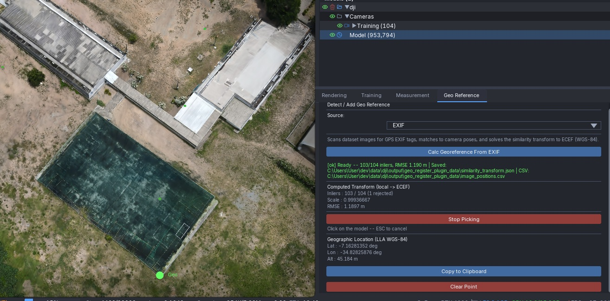
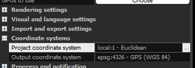
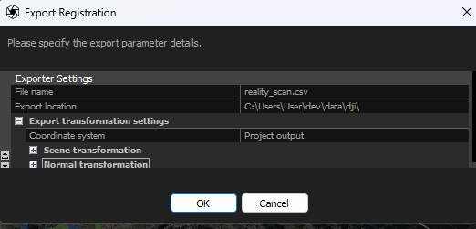

# Geo Register Plugin

Registers a [LichtFeld Studio](https://github.com/MrNeRF/LichtFeld-Studio/) scene to real-world geographic coordinates (WGS-84 / ECEF).
Once registered, clicking any point on the model returns its latitude, longitude, and altitude.



---

## How It Works

The plugin solves a **similarity transform** that maps scene-space coordinates to
ECEF (Earth-Centered Earth-Fixed) coordinates:

```
world_ecef = scale * R @ p_scene + translation
```

Where:
- `scale` — uniform scale factor between scene units and metres
- `R` — 3x3 rotation matrix
- `translation` — 3D translation vector in metres

The transform is estimated using a robust RANSAC + IRLS solver (Umeyama 1991),
which automatically rejects outlier correspondences.

---

## Source Modes

Use the **Source** dropdown to choose how geographic reference data is provided.

---

### 1. EXIF

Automatically extracts GPS coordinates embedded in the original drone/camera images,
matches them to the camera poses in the loaded scene, and solves the transform.

**Steps:**
1. Load your dataset in LichtFeld Studio.
2. Select **EXIF** from the Source dropdown.
3. Click **Calc Georeference From EXIF**.

The plugin scans the dataset folder for images with GPS EXIF tags, matches each image
to its camera pose by filename stem, and runs the solver.

> **Original images folder:**
> If your dataset images no longer contain GPS EXIF data (e.g. they were undistorted
> or re-encoded), click **Set Original Images Folder** to point the plugin at the
> folder containing your original images. The plugin will scan that folder for GPS
> tags instead.
> The filename **stem** (name without extension) must match between the original
> images and the dataset cameras — for example, `DJI_0001.jpg` (original) matches
> `DJI_0001.JPG` or `DJI_0001.png` in the dataset.

> **Note on undistorted images:**
> Tools like RealityCapture, RealityScan, and COLMAP often undistort or re-encode images
> during processing, which strips the original EXIF metadata — including GPS tags.
>
> **If your images have been undistorted, you have two options:**
>
> - **Preferred:** Skip undistortion and use the original images directly. LichtFeld Studio can undistort the images natively.
>
> - **Alternative:** Copy the EXIF data from the originals to the undistorted images
>   using [ExifTool](https://exiftool.org/):
>   ```
>   exiftool -tagsfromfile original/%f.jpg -gps:all undistorted/%f.jpg
>   ```
>   Run this command in the folder that contains both your original and undistorted images.

---

### 2. Similarity File

Loads a previously computed similarity transform from a JSON file.
Useful when you already have a valid transform (e.g. exported by this plugin from a
different session or computed externally).

**Steps:**
1. Select **Similarity File** from the Source dropdown.
2. Click **Load Similarity File** and pick a `.json` file.

**Expected JSON format:**

```json
{
  "scale": 0.999367,
  "rotation": [
    [ 0.9998,  0.0123, -0.0156],
    [-0.0121,  0.9998,  0.0089],
    [ 0.0157, -0.0087,  0.9998]
  ],
  "translation": [4052845.12, 617312.45, 4867891.78],
  "rmse_m": 1.190,
  "n_inliers": 103,
  "n_total": 104
}
```

**Matrix composition:**

The transform applies components in this order:

1. **Scale** — multiply the scene point by `scale`
2. **Rotate** — apply the 3x3 rotation matrix `R`
3. **Translate** — add the `translation` vector

In matrix form as a 4x4 homogeneous transform:

```
| scale*R  translation |   @   | x |       | x_ecef |
|    0          1      |       | y |   =   | y_ecef |
                               | z |       | z_ecef |
                               | 1 |       |   1    |
```

The plugin exports this JSON automatically after every EXIF or CSV solve, to
`<output_dir>/geo_register_plugin_data/similarity_transform.json`.

---

### 3. Image Positions CSV

Loads image GPS positions from a CSV file and runs the same solver as the EXIF mode.
Useful when GPS data is not embedded in the images (e.g. stored separately by the
drone flight controller, or sourced from a ground control point log).

**Steps:**
1. Select **Image Positions CSV** from the Source dropdown.
2. Click **Load CSV File** and pick a `.csv` file.

**Required CSV format:**

The file must have a header row with exactly these column names:

```
#image_name,lat,lon,alt
DJI_0001.JPG,32.08154321,34.78912345,48.250
DJI_0002.JPG,32.08163897,34.78924561,48.431
DJI_0003.JPG,32.08172450,34.78937812,48.619
DJI_0004.JPG,32.08181023,34.78951034,48.802
```

- `image_name` — filename only, with extension (not a full path)
- `lat` — latitude in decimal degrees (WGS-84)
- `lon` — longitude in decimal degrees (WGS-84)
- `alt` — ellipsoidal altitude in metres

The plugin exports this CSV automatically after every EXIF solve, to
`<output_dir>/geo_register_plugin_data/image_positions.csv`.

---

### 4. RealityScan Parameters CSV

> **Recommended over EXIF when you aligned your data with RealityScan.**
>
> RealityScan performs bundle adjustment that refines each camera's position beyond
> the raw GPS reading. Importing these adjusted positions instead of raw EXIF gives
> significantly better geo-registration accuracy, because the plugin fits the
> similarity transform to coordinates that are already internally consistent with
> the reconstructed model. Expect a noticeably lower RMSE compared to EXIF mode.

**How to export from RealityScan:**

**Step 1 — Set the project output coordinate system to WGS 84:**

Go to **Workflow → Settings → Coordinate System** and set the output coordinate
system to **EPSG:4326 – GPS WGS 84**.



**Step 2 — Export Internal/External Camera Parameters:**

In the export dialog, choose **Internal/External Camera Parameters**.
In the export settings, set the coordinate system to **Project Output**.



**Step 3 — Load in the plugin:**

1. Select **RealityScan Parameters CSV** from the Source dropdown.
2. Click **Load RealityScan CSV** and pick the exported `.csv` file.

**CSV format (exported by RealityScan):**

```
#name,x,y,alt,yaw,pitch,roll,f_35mm,px_norm,py_norm,k1,k2,k3,k4,t1,t2
DJI_0214.JPG,-34.82878738,7.16331052,86.94,131.99,...
```

- `name` — image filename
- `x` — longitude (decimal degrees, WGS-84)
- `y` — latitude (decimal degrees, WGS-84)
- `alt` — ellipsoidal altitude in metres

All other columns (yaw, pitch, roll, lens parameters) are ignored by the plugin.

---

## Output Files

After a successful solve the plugin writes to `<output_dir>/geo_register_plugin_data/`:

| File | Description |
|---|---|
| `similarity_transform.json` | The solved transform (scale, R, t, RMSE, inlier counts) |
| `similarity_transform_info.txt` | Human-readable explanation of the transform fields |
| `image_positions.csv` | GPS positions of all matched images (EXIF and CSV modes) |

---

## Requirements

- At least **3 matched image–camera pairs** are required to solve the transform.
- Camera poses must be available in the loaded scene or in a COLMAP / NeRF
  `transforms.json` file in the dataset folder.
